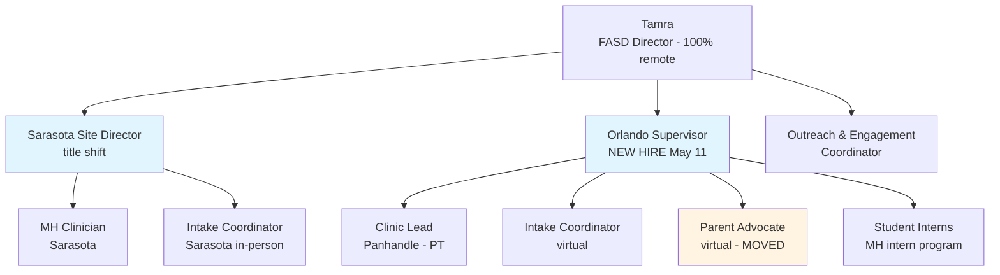
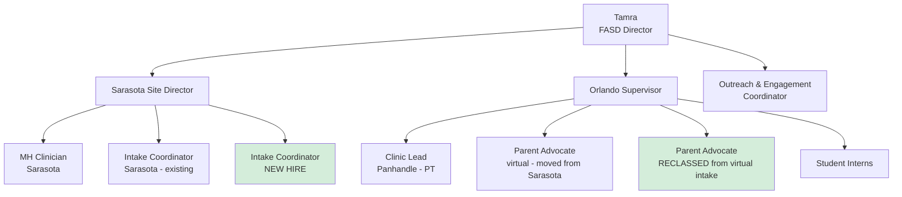
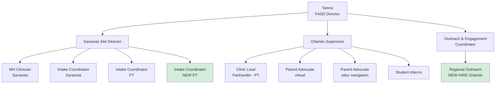
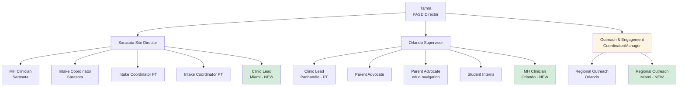

# FASD Program Org Chart Scenarios — FY26-27 Planning

*Date: April 17, 2026*
*Working planning document. Four scenarios at increasing funding levels. Decisions land by July 1 (start of new FY) once funding is known (~mid-June).*

---

## Foundation: Decisions Common to All Scenarios

These are good ideas regardless of which funding tier lands. Worth doing in May–June so they're in place by July 1.

- **Sarasota Supervisor title shift** to recognize current load (e.g., *Sarasota Site Director* or *Director of Clinical Operations*). Title doesn't depend on funding.
- **Parent Advocate (virtual) moves from Sarasota to Orlando supervision** — plays to the new Orlando hire's school social work background; reduces Sarasota Supervisor's span; gives Orlando a substantive family services portfolio.
- **Clarify supervision design** (location-based vs. program-based vs. hybrid) — title chosen for Sarasota Supervisor implies which.
- **Coordinator role definition is locked in** — JD revised, worksheet, strategic doc all in place.
- **Have the 1:1 conversations** — Sarasota Supervisor (recognition + concerns), Coordinator (felt-safety/role context).
- **Restructure the leadership meeting** — weekly supervisor sync stays as is; consider monthly Program Leadership Meeting that includes the Coordinator (no individual personnel content).

---

## Hire Priority Order (Tamra to confirm/adjust)

Walk down this list in funding order — fund hires top-to-bottom until the money runs out.

1. **New Intake Coordinator (FT)** — intake as main landing place is the strategic priority; this is the foundational hire.
2. **Reclass virtual Intake Coordinator → Parent Advocate role** (caregiver support + educational navigation). Not a new hire — same FTE, expanded scope. Pairs naturally with #1 since the new intake hire backfills.
3. **Regional Outreach & Engagement, Orlando** — extends outreach to a second region, supports Coordinator, doesn't require Miami expansion.
4. **Part-time Intake Coordinator** — depth on the intake team once consolidated.
5. **Regional Outreach & Engagement, Miami** — kicks off Miami expansion through outreach (lighter cost than clinical).
6. **Miami Clinic Lead** — formalizes Miami presence as a clinic site.
7. **Second MH Clinician (Orlando)** — only if wait list grows enough to warrant it.

---

## Tier 0: Status Quo (~$1.1M, no additional funding)

**Hires added:** None
**Internal changes only:** Title shift for Sarasota Supervisor; Parent Advocate moves to Orlando supervision.

**What changes from today:**
- Sarasota Supervisor → Sarasota Site Director (recognition)
- Parent Advocate moves to Orlando supervision
- Sarasota goes from 3 reports → 2 (some breathing room)
- Orlando goes from 3 reports → 4

**What gets deferred:** All hires. Intake stays split (in-person Sarasota + virtual Orlando). No Miami expansion. No regional outreach.

---

## Tier 1: Small Bump (+$200–400K, total ~$1.3–1.5M)

**Hires added:** New Intake Coordinator (FT) + reclass virtual Intake → Parent Advocate role
**Decision point:** Does intake consolidate in Sarasota? *Recommended yes* — the new hire is in-person Sarasota; existing in-person intake stays.

**What changes from Tier 0:**
- New Intake Coordinator hired into Sarasota — intake now consolidated
- Virtual Intake Coordinator reclassed into Parent Advocate role — Orlando now has 2 Parent Advocates
- Sarasota: 3 reports (back to original count, but now 2 of them are intake — coherent program)
- Orlando: 4 reports (Clinic Lead, 2 PAs, Interns) — strong family services portfolio

**Tradeoff to flag:** Sarasota's 3 reports are now MH Clinician + 2 Intake. Coherent. But Sarasota Supervisor still owns clinic operations across 3 sites, so total load is still heavy.

---

## Tier 2: Mid (+$600–800K, total ~$1.7–1.9M)

**Hires added (on top of Tier 1):** Regional Outreach (Orlando) + part-time Intake Coordinator

**What changes from Tier 1:**
- Part-time Intake Coordinator added → Sarasota has 4 reports (3 intake + MH Clinician)
- Regional Outreach hired in Orlando, reports to **Coordinator** → Coordinator becomes a supervisor for the first time
- This is the structural moment when the Coordinator's leadership-meeting question changes

**Implications worth flagging:**
- Sarasota Supervisor now has 4 reports + clinic operations across 3 sites — getting heavy. Worth asking: do we add an intake team lead under her to manage day-to-day intake?
- Coordinator becoming a supervisor = the structural reason for excluding her from the leadership meeting starts to dissolve. The "monthly Program Leadership Meeting" becomes more important.

---

## Tier 3: Full Request (+$1.2M, total $2.3M)

**Hires added (on top of Tier 2):** Regional Outreach (Miami) + Miami Clinic Lead + Second MH Clinician (Orlando area)

**What changes from Tier 2:**
- Miami Clinic Lead added — assumed under Sarasota Site Director (clinic ops cluster), but worth deciding
- Second MH Clinician added in Orlando area — under Orlando Supervisor (clinical/MH cluster grows there)
- Regional Outreach Miami added under Coordinator → Coordinator now has 2 reports

**Major structural questions Tier 3 forces:**
1. **Sarasota Site Director now supervises 5 people + clinic operations across 4 sites** — almost certainly too much. Likely needs:
   - An intake team lead (within her staff) handling day-to-day intake supervision
   - OR splitting clinic operations into a separate role
   - OR title shift to Director of Clinical Operations with intake going elsewhere
2. **Coordinator becomes a real manager of a team of 2.** Title may shift (e.g., *Outreach & Engagement Manager* or *Director of Outreach & Engagement*). She's now in the leadership-meeting conversation differently.
3. **Miami Clinic Lead reporting line is open.** Could go to Sarasota Site Director (clinic ops everywhere) or eventually to a Miami-based lead if Miami grows.

---

## Cross-Tier Observations

- **The Sarasota Supervisor's load grows or stays heavy in every tier.** No tier solves this without an explicit decision to reshape her portfolio (intake team lead, clinic ops director split, etc.). Worth deciding *what's coming off her plate* in any tier where you add to it.
- **The Coordinator role evolves significantly between Tier 1 and Tier 2.** The structural answer to "should she be in the leadership meeting" depends on which tier you're in. Plan to revisit the meeting structure when she gets her first report.
- **Orlando Supervisor's portfolio stabilizes around family services + clinical + interns** — this matches the new hire's strengths regardless of tier.
- **Panhandle is structurally capped** in every tier — Clinic Lead can stretch but not run a team. Panhandle staff always roll up to Sarasota or Orlando.
- **Miami expansion (Tier 3 only) creates a third location** that none of the current supervisors are anchored to. Worth deciding whether Miami staff are clustered under one existing supervisor or whether long-term they need a Miami-based supervisor.

---

## Open Questions for Each Tier

**Tier 0:**
- Is the title shift (e.g., Sarasota Site Director) something you can move on now, or does it require funding/HR conversations?
- Does Parent Advocate moving to Orlando supervision happen May/June (during onboarding) or July 1?

**Tier 1:**
- Is intake consolidation in Sarasota a yes? Or do we want to keep some virtual intake under Orlando as a hedge?
- New intake hire — is FT realistic in this tier, or would PT be more likely?

**Tier 2:**
- Does the Coordinator becoming a supervisor change her title? Compensation?
- At 4 reports + clinic ops across 3 sites, does Sarasota Site Director need an intake team lead under her?

**Tier 3:**
- How do we reshape the Sarasota Site Director's role to make 5 reports + 4-site clinic ops sustainable?
- Where does the Miami Clinic Lead report — Sarasota (clinic ops) or eventually a Miami site lead?
- Does the Coordinator's title change (Manager? Director?) and does that re-open the agency leadership-meeting question?

---

*Next step suggestion: pick the most likely tier (your gut on the funding outcome) and pressure-test that org chart against actual workflow — who would each new person work with day-to-day, who answers their questions, where do handoffs happen. That stress-tests whether the structure works in practice.*
